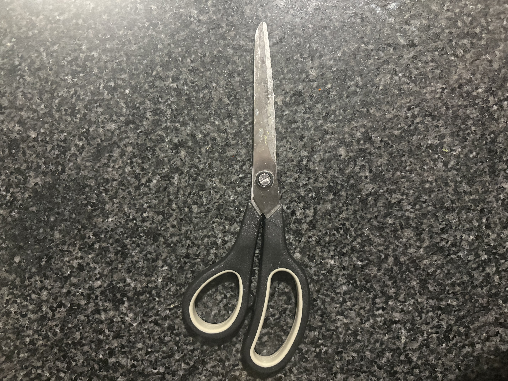
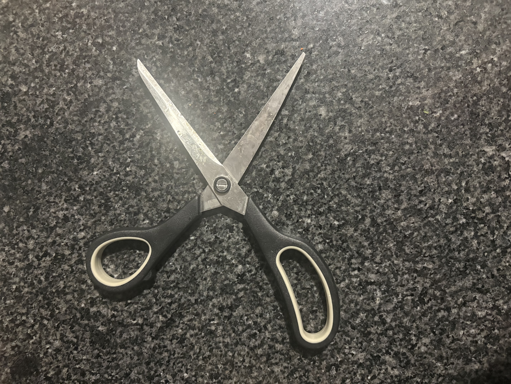
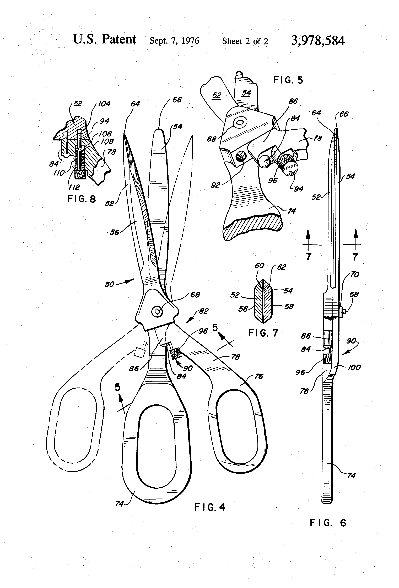

# A1 – My Portfolio

## Objective
The objective of this assignment is learn and get a feeling for the main three subjects in every upcoming assignments which are to analyze, decide, and to communicate as an engineering and doing this all while creating a new online portfolio.

## Analyze
### Task A: Portfolio analysis
**Portfolio 1:**  [Ronnie Shani](https://instructure.charlotte.edu/eportfolios/4406/home/about-me) 

A.) Navigability - All assignments are shown on the mage page with a side tab allowing the user to access any assignment they desire instantly from opening the portfolio page. It is also organed in chronological order making it easier on the user to find the assignment they would like to view.

B.) Reproducibility - This portfolio does provide enough information to be reproduced. He provides all variables and constraints needed in the problem and Cleary states the objective at hand and what he is trying to accomplish with the variables. He even adds models he draws of the given problems allowing the user to better visualize the objective at hand and to reconstruct their own work and see if they arrive at the same final answer. 

C.) Evidence of reasoning - He has a clear flow of work and reasoning with images of all of his work and calculations in order and right below each step so you know what the work is for. Then underneath this work he explains what he is doing and why he is doing it allowing the reader to get a better understanding of the engineering work process. This explanation includes formulas, reasonings, explained decision making, etc... all leading up to his final answer which is clearly shown and explained on each assignment.

D.)  Professional tone - This portfolio does meet the standard of a professional document for an employer. He clearly explains what he is writing about in each section to make sure there is no extra interpretation needed and has a easy flow to make sure the user does not get lost.

**Portfolio 2:** [Melih Gulum](https://github.com/MelihGulum/Comprehensive-Data-Science-AI-Project-Portfolio)

A.) Navigability - You are able to access all projects directly off the home page allowing for quick and easy viewing. He has also organized all of the projects into subsections so that the user can search for specific projects based on the overall topic such as machine learning, data analysis, or AI systems

B.) Reproducibility - Any user would be able to reproduce these projects as he includes exactly what the objective is of the project and what he is trying to accomplish with the end goal. He also includes extra information about the subject before working on the project so that the user can start with no background knowledge at all and take all the same steps he did and come at the same final conclusion. 

C.) Evidence of reasoning - This portfolio does a great job of showing you the work provided and the reasoning behind their final outcome. They include pictures, charts, diagrams, and many other forms of evidence showing every step they take and have explanations and reasoning's for each step undeath in text. They even run through some of the mistakes they make  while showing the correct work to help guide the user away from the same mistakes.

D.) They have great professional tone throughout this portfolio. It has many bullet points that are straight to the point with an explanation for certain pieces of work or for including extra information while also including entire paragraphs at times to ensure the reasonings is fully explained. It has every piece of critical information an employer could need while also begin very well organized and professionally laid out.

### Part B: Product Analysis
A.) The mechanical product I have chosen is the normal pair of house scissors. The primary function of scissors is to convert force from your hands into two shearing blades allowing you to cut through objects you would not be able to with you hands alone.

B.) Governing Model - i.) The primary equation that governs scissors and what it cuts is T = F/A   where T is the shear stress in the object being cut, F is the force applied, and A is the surface area the scissors touch while cutting
ii.) One assumption that is to be made using this governing equation is that there is no friction between the material being cut and the scissors in order to get to get the correct force and shear stress equation

C.) The scissors are made up of two sharpened blades connected to each other with a pivot point with holes on one side for your fingers to hold and apply force. The handle has a curved shape for you fingers to fit better and is a little farther away from the pivot to create more moment around it. The blades are sharpened to reduce the amount of contact area in return creating a larger stress of the object. The cutting area is also positioned as close to the pivot in order to maximize the force being applied directly into the object. 

D.) This is the first patent for the modern day ambidextrous scissors [here](https://patents.google.com/patent/US3978584) patent number: US3978584A invented by John W. Mayer

i.) One alternative solution to using scissors is a simple knife as it has one single sharpened blade that is also used to cut through materials. A second alternative is a paper guillotine where the object is placed against a stationary table and a single sharpened blade is rotated around a pivot to cut through the object.

ii.) The biggest descion choice the original engineer made was the location of the pivot point. If it would be any farther from the handle it would greater reduce the cutting distance and increase the length the handle and the hand would have to move while if it was any closer to the handle it would decrease the mechanical advantage making the user apply more force making the position its at a balance between mechanical advantage and hand travel needed. 

## Decide
A.) Homepage Identity: my homepage will contain an overview of the engineering projects and assignments I have worked on to show future employer the work ethic and skills I have aqquired at college. While there will be an overview about the projects it will also be organized so that they can access anu of my individual assignments in an instant to deeper dive into that subject. I Will also include images, work, and explanations to ensure a user will be able to understand the line of work and to be in depth enough to where they would be able to reproduce the same assignment and final answer as me by being clear and in depth enough in what I am working on and what I am trying to solve.

B.) One Intentional Customization: I have changed the main color theme from a bright green to a light grey. The reason for this because the bright green felt distracting from the portfolio and while it is the college color the grey is more professional looking and makes the portfolio look like a document I can give to an employer. 

C.) Documentation Standard: I want this portfolio to reach a documentation standard that is very in depth in every aspect I am writing about and having a very professional tone so that I can be confident enough in this portfolio to give to a future employer and not just a friend. 

## Communicate

The communicate section is on the about me tab as stated to do so in the assignment
