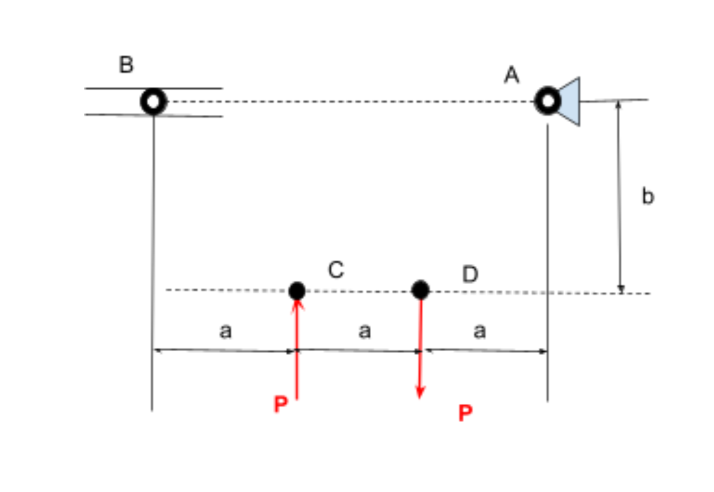
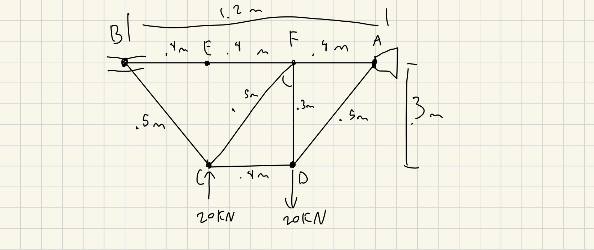
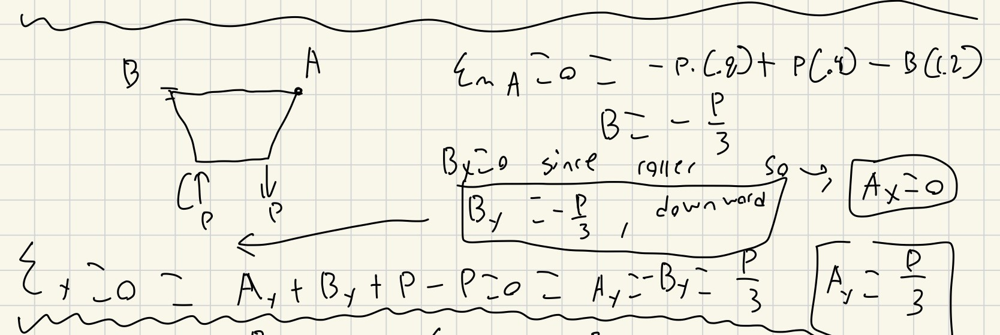
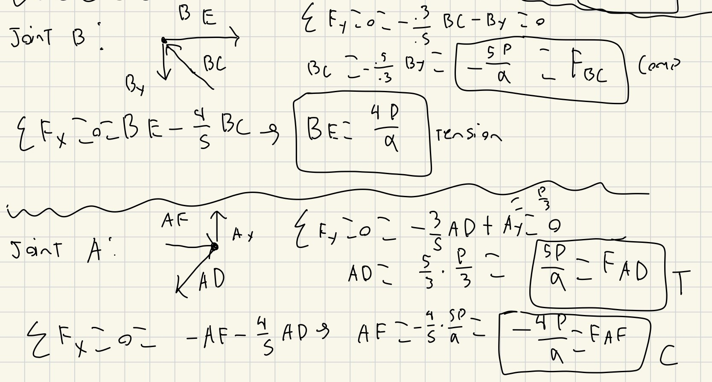
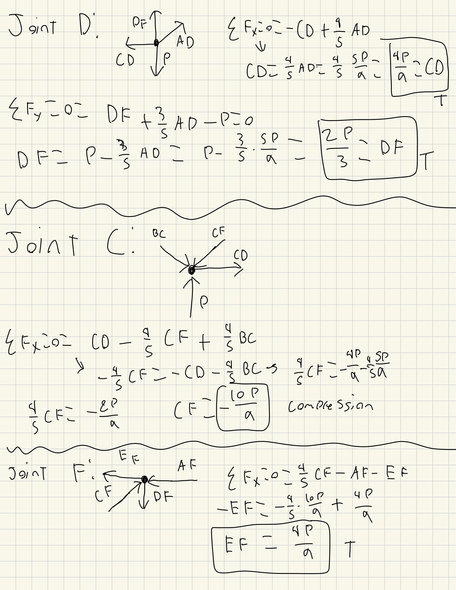

# A2 – Truss Stress Analysis

## Objective
The objective for this assignment was to design a lightweight planar truss using A500 steel or an alternative material. Create free body diagrams (FBDs) for joints and critical pins. Calculate the required cross-sectional area of truss elements with a safety factor. Determine pin sizes based on shear forces with a safety factor. Solve equations symbolically and numerically for both truss and pin design. Estimate the total weight of the truss and pins. Create a CAD model with accurate dimensions and connections. Compare CAD weight predictions with hand calculations. Document key engineering lessons learned from the process.

These were the parameters given where P= 20KN, a= .4m, b= .4m, A is a pin, and B is a roller.

## Analyze
### Truss Geometry

Based on the given parameters this was the design I had landed on. I first made the outside structure by simply connection all point necessary and then made the internal beams. I was trying to use triangles as much as possible as I know from previous works that they are very good at distributing and handling forces. I had also originally had one more beam vertically from point C to E but quickly realized that it carried no load meaning all it was doing was adding weight so I removed it before making this my final design to work with. This design had also reminded me of many trusses i have done calculations on before so I would be familiar and confident in my internal forces. I had also figured out the length of the diagonal beams to be .5m through the Pythagorean theorem that .3^2 + .4^2 = C^2 so C = .5m

### Free Body Diagram

The next thing to do was to create a free body at each joint and to find all of the internal forces in each beam. I started with using the moment for the external forces to find both the support reactions in A and B symbolically in terms of P. By using the moment I was able to Isolate just B alone and since B is a roller joint it cannot have any support in the x direction only the y so the entire moment force would be in the y direction. From that I used the normal force balances to find Ay and since there is no force in the x direction form B there would be no force in the x direction in A either. 

After finding the external forces I was able to start calculating the internal forces. I did this by using the method of joints which takes just the forces at each joint in both the x and y directions separately to isolate one unknown at a time and then use the new forces and information to solve for the next one step at a time. The first joint i chose was Joint B as as i new By and there was only one other force in the y direction allowing me to isolate it and solve for it in terms of P. 

By solving step by step I was able to go joint by joint isolating each member in order to get them in terms of P. From this is was also able to determine if a member was either in tension or compression. If my symbolic calculation for them was positive it meant that member was in Tension (T) and if the equation was negative it meant the member was in compression (C). After getting all of the symbolic equations in terms of P all I had to do was plug in the value of P = 20KN to get the exact internal forces in member.

!{internal forces](
## Decide
_Which geometry did you select, and why? This is your first open design choice in the course — defend it._

## Communicate

