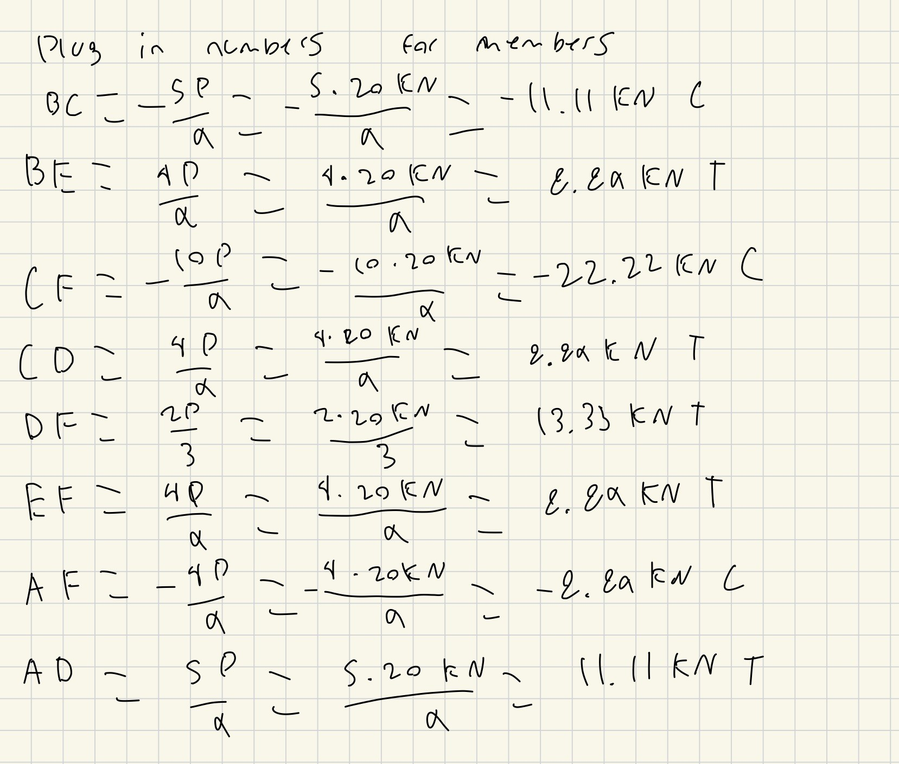
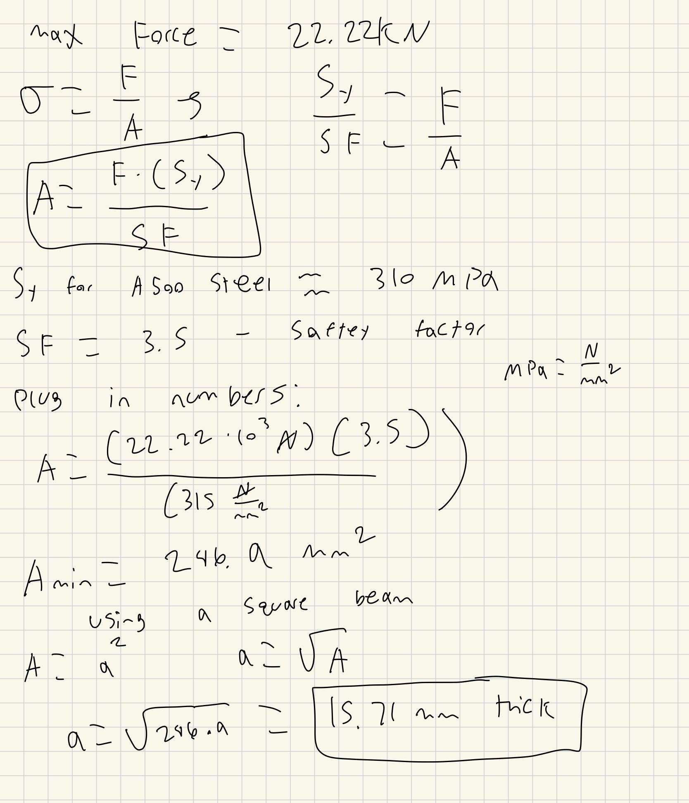
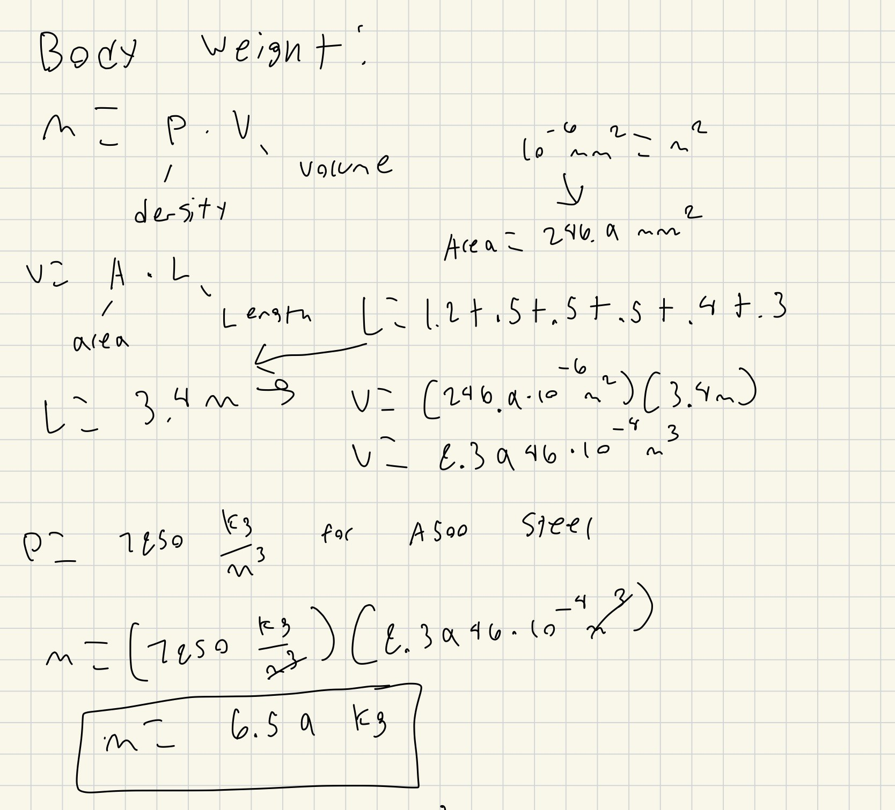
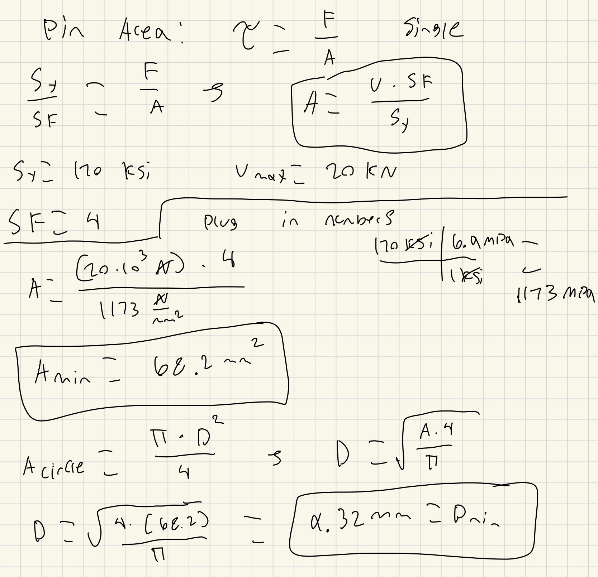
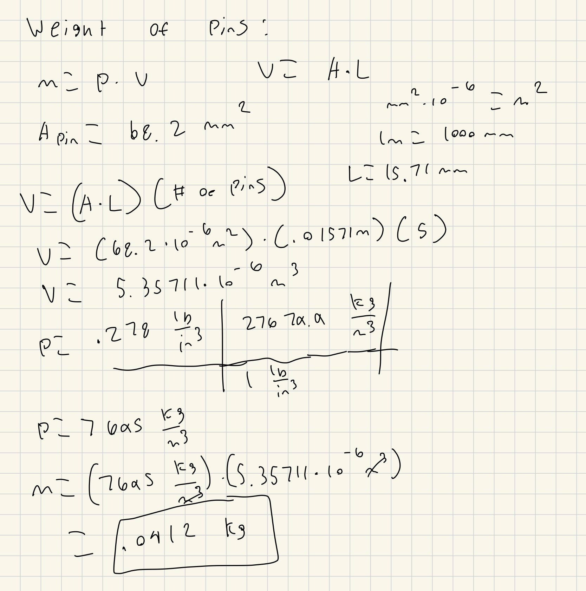
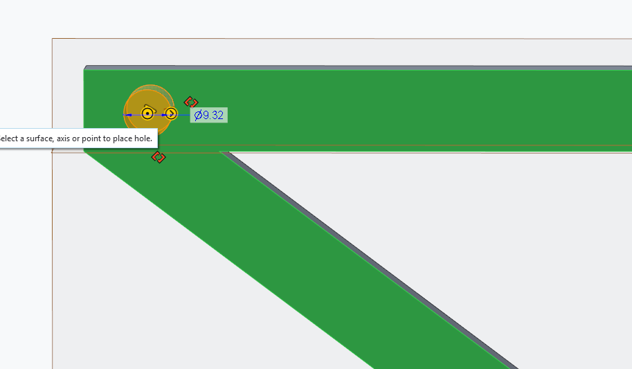
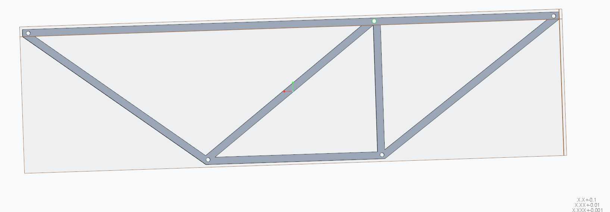
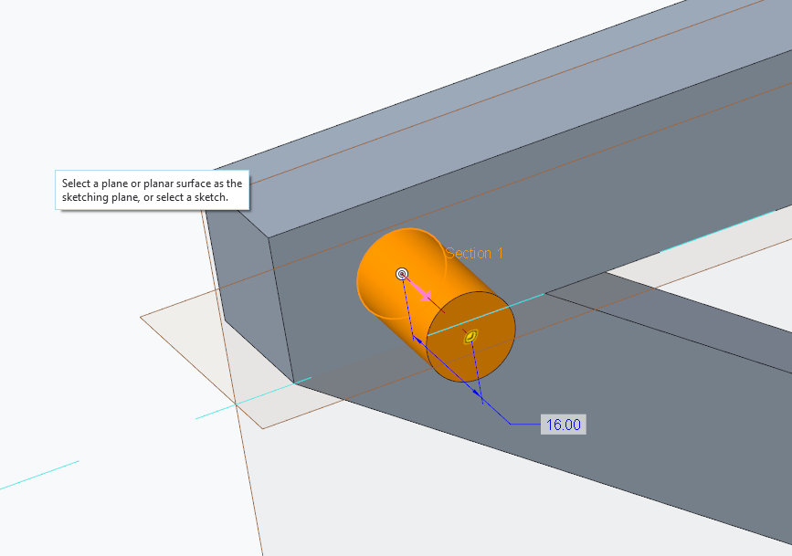
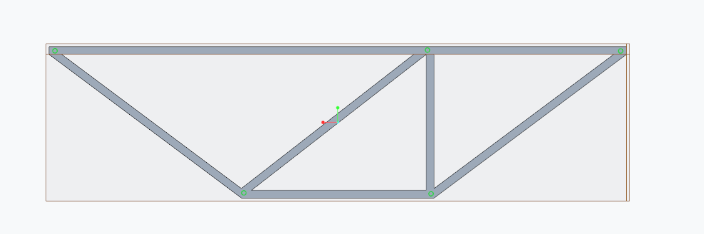

# A2 – Truss Stress Analysis

## Objective
The objective for this assignment was to design a lightweight planar truss using A500 steel or an alternative material. Create free body diagrams (FBDs) for joints and critical pins. Calculate the required cross-sectional area of truss elements with a safety factor. Determine pin sizes based on shear forces with a safety factor. Solve equations symbolically and numerically for both truss and pin design. Estimate the total weight of the truss and pins. Create a CAD model with accurate dimensions and connections. Compare CAD weight predictions with hand calculations. Document key engineering lessons learned from the process.

These were the parameters given where P= 20KN, a= .4m, b= .4m, A is a pin, and B is a roller.

## Analyze
### Truss Geometry

Based on the given parameters this was the design I had landed on. I first made the outside structure by simply connection all point necessary and then made the internal beams. I was trying to use triangles as much as possible as I know from previous works that they are very good at distributing and handling forces. I had also originally had one more beam vertically from point C to E but quickly realized that it carried no load meaning all it was doing was adding weight so I removed it before making this my final design to work with. This design had also reminded me of many trusses i have done calculations on before so I would be familiar and confident in my internal forces. I had also figured out the length of the diagonal beams to be .5m through the Pythagorean theorem that .3^2 + .4^2 = C^2 so C = .5m

### Free Body Diagram

The next thing to do was to create a free body at each joint and to find all of the internal forces in each beam. I started with using the moment for the external forces to find both the support reactions in A and B symbolically in terms of P. By using the moment I was able to Isolate just B alone and since B is a roller joint it cannot have any support in the x direction only the y so the entire moment force would be in the y direction. From that I used the normal force balances to find Ay and since there is no force in the x direction form B there would be no force in the x direction in A either. 

After finding the external forces I was able to start calculating the internal forces. I did this by using the method of joints which takes just the forces at each joint in both the x and y directions separately to isolate one unknown at a time and then use the new forces and information to solve for the next one step at a time. The first joint i chose was Joint B as as i new By and there was only one other force in the y direction allowing me to isolate it and solve for it in terms of P. 

By solving step by step I was able to go joint by joint isolating each member in order to get them in terms of P. From this is was also able to determine if a member was either in tension or compression. If my symbolic calculation for them was positive it meant that member was in Tension (T) and if the equation was negative it meant the member was in compression (C). After getting all of the symbolic equations in terms of P all I had to do was plug in the value of P = 20KN to get the exact internal forces in member.

### Cross Sectional Area 

From my internal force calculations I determined that my max force was 22.22 KN. I then used this force to determine my minimum cross sectional area for the body of my square truss. I was able to use the stress formula shown below to find the needed cross sectional area. I did this by replacing the stress with the yield strength of 315 MPA for A500 steel and plugging in my safety factor of 3.5 in order to make sure my truss would be strong enough throughout unknown external circumstances. I then could isolate my area which was the only unknown and solve for it by plugging in my numbers getting a cross sectional area of 246.9mm^2. Since i was using a square beam I knew the width would be the same as the height so to get the width i had to square root my area to get a width of 15.71mm thick.

Now having the cross sectional area I wanted to calculate and predict what the weight of the truss would be. I used the mass equation where mass equal density times volume but i still didn't have the volume. However this was much simpler than i thought as since i already had the cross sectional area i knew volume is just area * length so I then added up all the lengths and multiplied it by my area to get my total volume. The density for A500 steel is around 7850 Kg/m^3 so i multiplied it by my total volume to get my theoretical weight of the truss of 6.59 Kg.

### Pin Cross Sectional Area 

The last calculations were to find the minimum cross sectional area for the pins under single shear stress. Using the equation for single shear stress of yield strength/(safety factor) = force/area I was able to isolate area alone and plug in the rest of the knowns. The yield strength was given for this hardened tool steel was 170 KSI, the safety factory was 4, and I used the same max force of 22.22KN. I was able to determine the minimum cross sectional area to be 68.2mm^2. Then using the area formula for a circle I found the diameter of the pin to be 9.32mm.

Now using the same formula for mass as before I was ready to solve for the total weight of the pins. The volume was simple as it was just the privous cross sectional area multipled by the thickness of the body which was 15.71mm. After getting the volume I multiplied it by the density of the tool steel of .278 lb/in^3 and then by the total numbers of pin to get the total mass of the pins to be .0412 Kg

## CAD Modeling

I took this truss design and went and modeled it in CAD. I started out by making each member one at a time making sure they are the correct length and thickness. I ended up rounding my thickness from 15.71 to 16 to make the CAD modeling a little easier. For this Model 1 base Unit is 1mm so 1200 is 1200mm or 1.2 m. 

Then I assembled all the members together to build the entire truss.

The next thing I did was create holes with a diameter of 9.32mm at each pin location so i could then insert the pins.

Finally I made the actual pins with the same thickness of 16mm and a diameter of 9.32 mm and inserted them into all of the holes in the truss.

And I had my fully assembled and completed CAD model of my truss.

## Communicate

