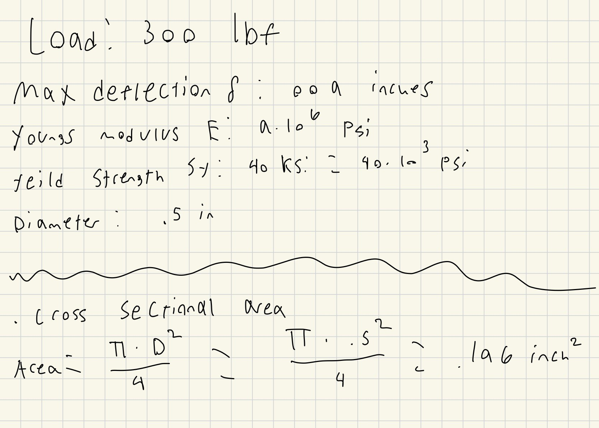
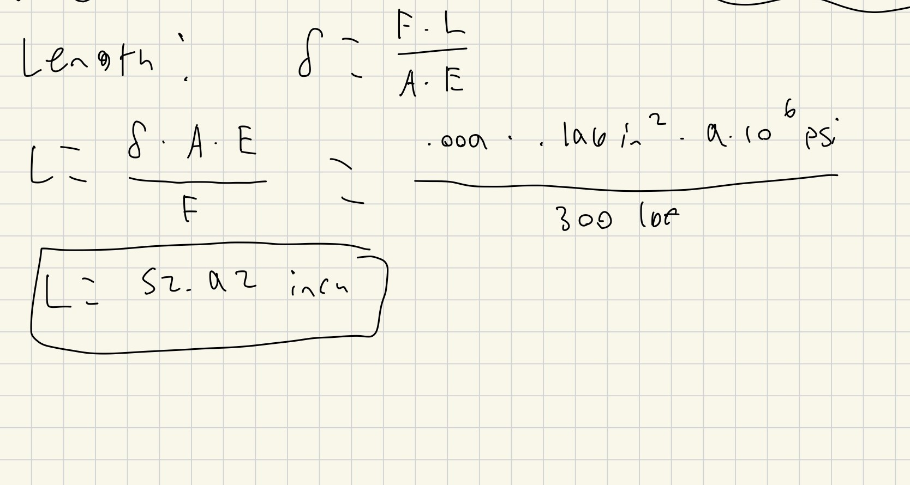
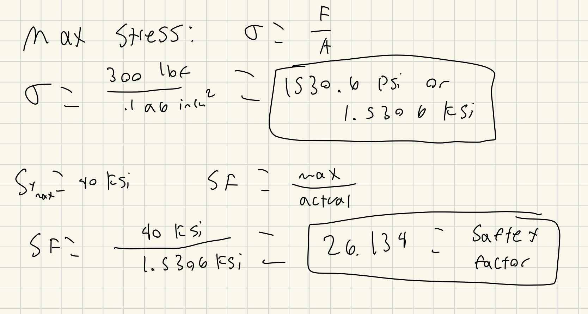
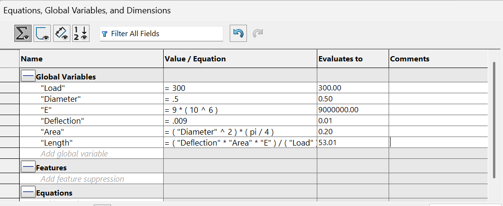
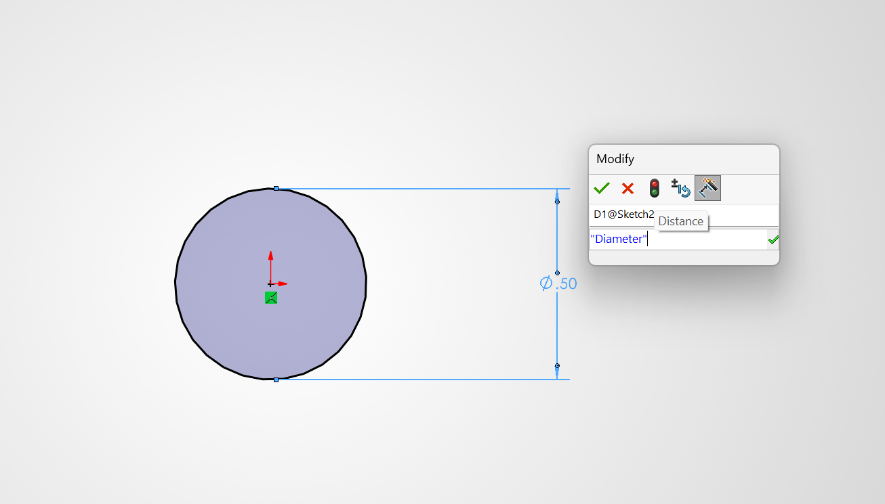
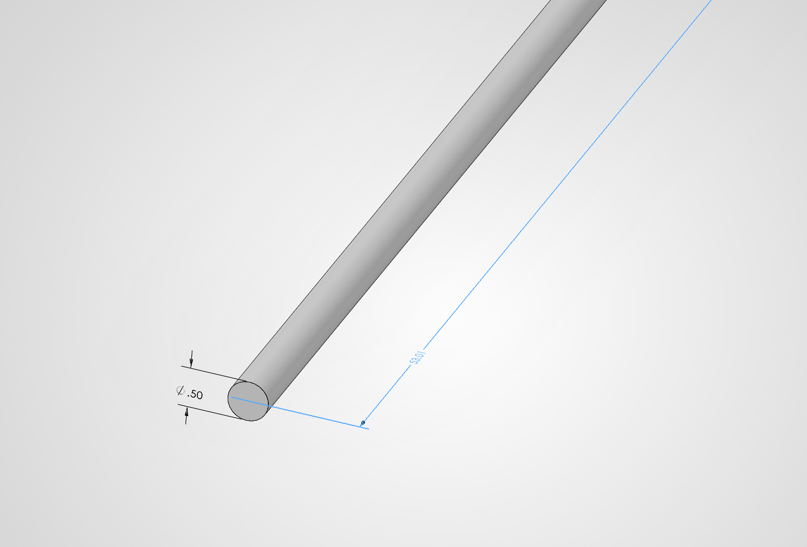
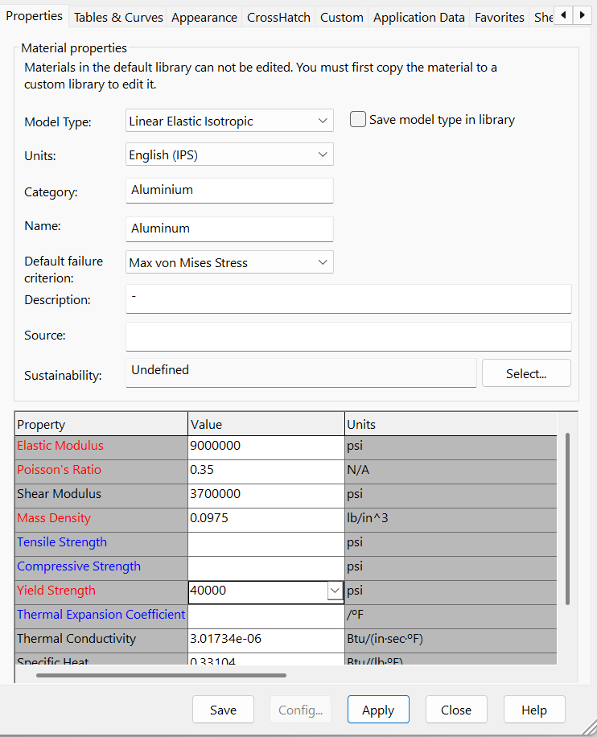
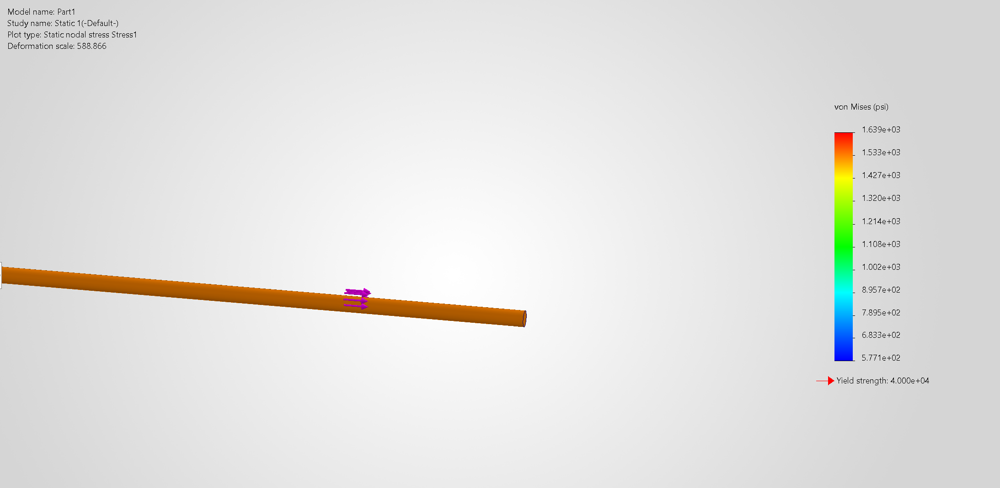
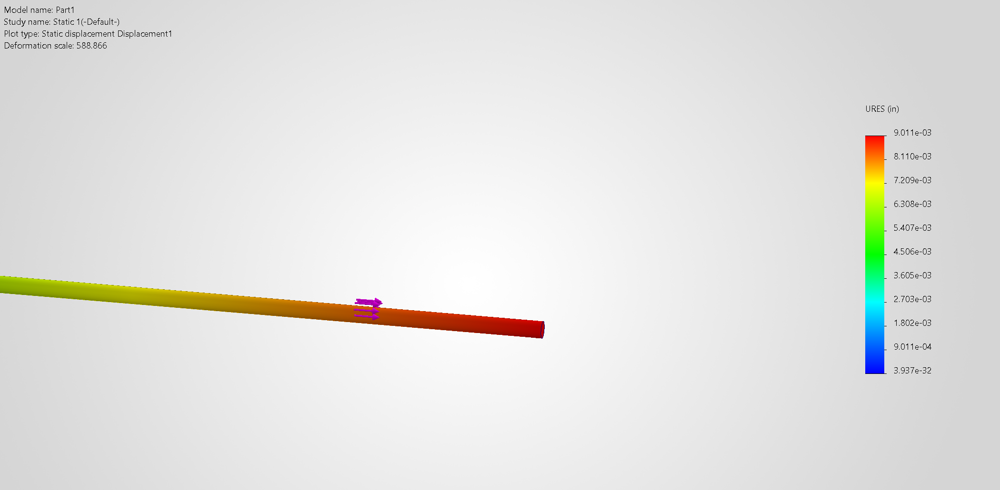
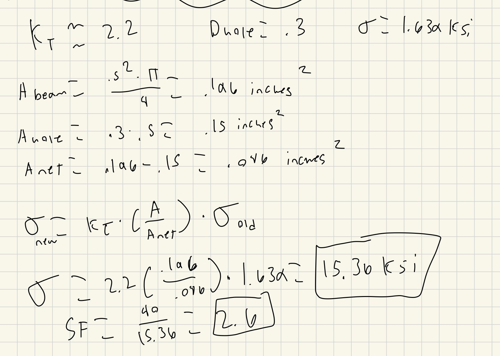

# A3 – Parametric and FEA Design

## Objective

The Objective of this assignment was to design a bar which has a circular cross section where the values of the criteria given for the material, maximum deflection, and load. Determine the bar’s minimum geometry (ie.. length, diameter, and weight) through parametric design while under direct tension. Then verify the geometry through finite element analysis.

## Analyze

### Cross Sectional Area

The first step in the beam design and length calculation was to find out the cross sectional area of a circular beam. The formula for the cross sectional area of a cylinder is (D^2)*(pi)/4. For this beam design i did some easy mental math and just decided to go with a diameter of .5 inches. Plugging this diameter into the formula gets a cross sectional area of .196 inches^2. 

### Length Calculation

Now that we have the cross sectional area we can find the max length beam without going over the allowed deflection. I did this by using the deflection equation where the deflction = (force*Length)/(Youngs Modulus*Area) and isolate length since all the other variables are known. Since we have the length isolated I plugged in all the values and found the maximum lenght of the beam to be 52.92 inches. 

### Stress and Saftey Factor

To make sure this beam was safe and wouldn't fail I calculauted the max stress on the beam from the load. The forumla for stress is just force / Area and when i plugged in the numbers i got a max stress of 1.5306 KSI which is much lower than teh max yeild strength of 40 KSI meaning this beam will not fail under this tension load. Then to calcuate the saftey factor all i had to do was divide the max yield strength by the actual stress and i got a safety factor of 26.134.

## CAD Modeling

### Parameteric Design

I first plugged all the known values into the equations tab into solid works. Then using these variables in solidworks I used the same formula for length and it solved and gave me a length 53.01 inches. The reason for the difference in length from my hand calculation is that solidworks rounded some of my values such as the area and the mas deflection. I then designed my beam and extruded it using the variables as my dimensions during the process.

This is the diameter of the beam

Here is the whole beam and the length of 53.01 inches

### FEA

Now that the beam model is complete I can run a FEA simulation on it. I set one side as a fixed geometry point and the other side with the load on it. I set the load to -300 lbf so that it would be pulling on the beam and would not be into the beam. I then ran the simulation and recorded the deflection and the max stresses.

This is the material properties for aluminum with a E of 9*10^6 PSI

The FEA simulation shows the max deflection to be 9.01 *10^-3 or .00901 inches and the max stress to be 1.639 KSI or 1639 PSI. 

[Link to Download CAD File](FEAdesignHW.SLDPRT)

## Communicate

### Design Reflection

Both my hand calculations and the FEA simulation came back with very very similar results but their was a tiny difference. The reason for this differnce was because Soidworks rounded some numbers early suhc as the area and the max deflection. In return this made the length a little longer and when I ran the simualtion the deflection was the slightest bit over .009 inches at .00901 inches making it very minimal. If the solidworks did not round at all and used the exact same area and length as my hand calculations i would trust it more but since the rounding did make the axial deflection just the tiniest bit larger than the max I trust my hand calculations more. 

### Pin Hole

For this I chose a substantial hole with a diameter of .3 inches. I then found that for a hole in a circular bar the stress concentration factor (Kt) is about 2.2. Next I found the net area of the bar minus the hole and found the ratio by diving the regular cross sectional area by the net area. I then multiplied this by the max stress from the FEA of 1.639 KSI and by the Kt and found the new max stress to be 15.36 KSI. This is still under the max yield strength of 40 KSI and still has a safety factor of 2.6.

## Lessons Learned 

I learned how to run simulations in Solidworks and other CAD programs in order to find max stresses and deflections with different materials and shapes. I also think i might have made a mistake in calculation the new stress for a pin hole in the beam as the new stress is a lot larger than the original max stress. This assignment took me about 3 hours to complete. 

