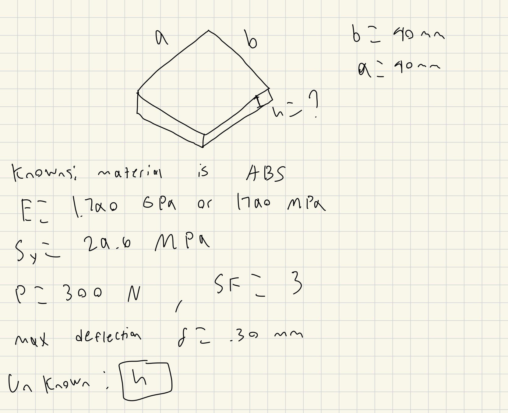
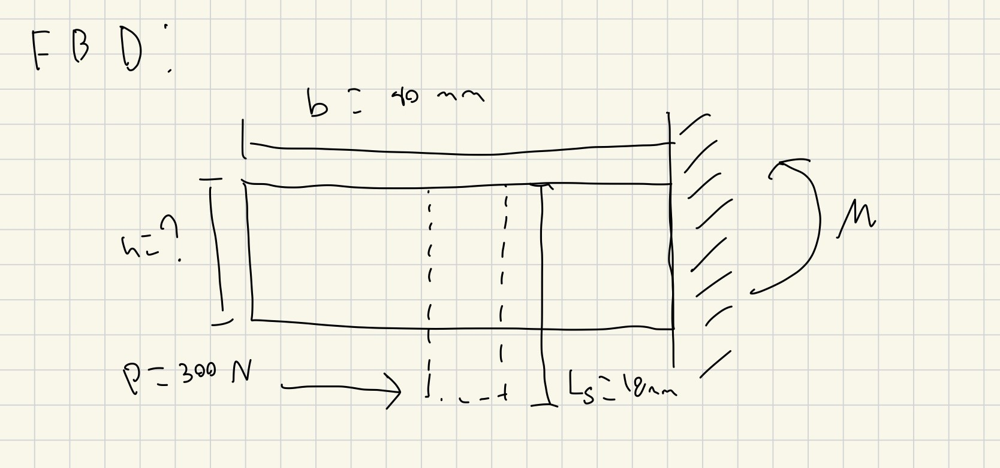
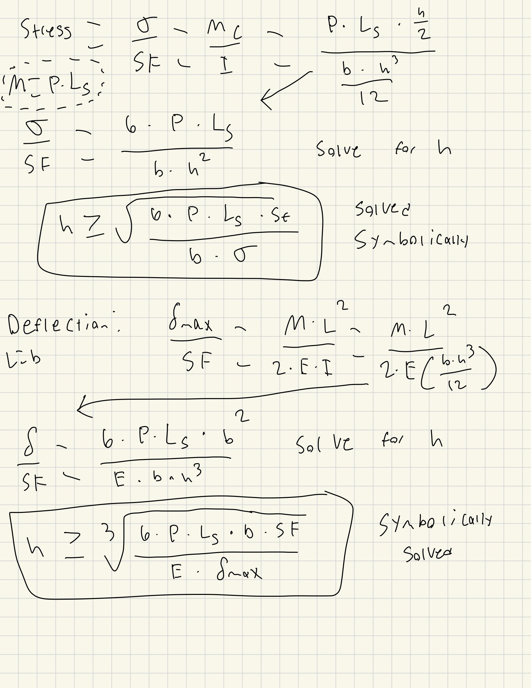
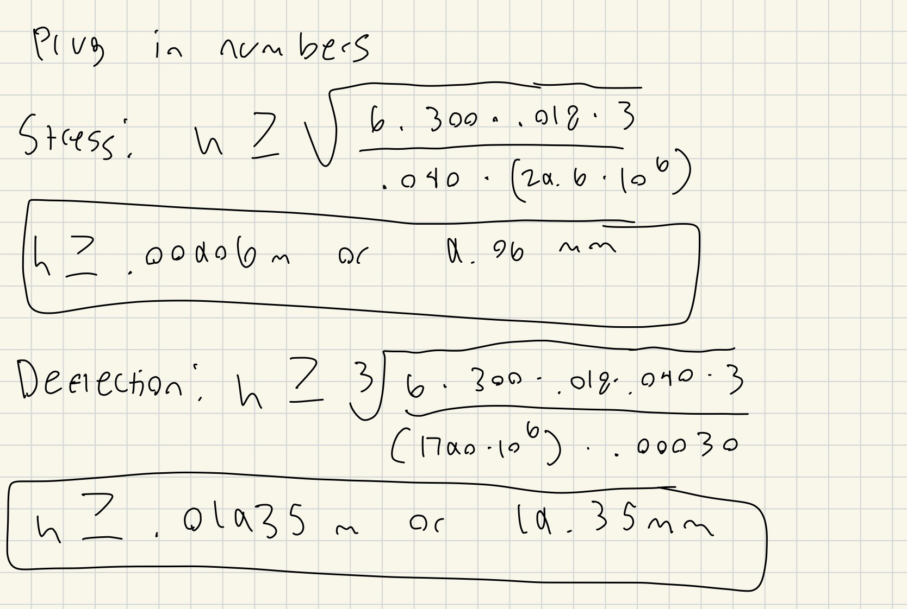

# A4 – [Topic]

## Objective

The objective of this assignment was to design a motor mount using a given brushed gear motor that attaches to a rigid wall. We have to decide the thickness of two features one which is attaches to to the motor and one which is attached to the wall by using the stress and deflection equations. We are using an ABS material with a safety factor of 3 and the initial force is 300 N.

## Analyze

### Feature 1 
The first feature I had to work on was the part that was directly attached to the motor. I decided to make the length and width of this feature to be 40 mm to make sure it is big enough to fit the motor no problem and to try and minimize the stresses and deflection. I first listed all the knowns and unknowns and drew the free body diagram to better understand.

From the free body diagram i see i am dealing with moment which is just force * distance but since the force is not being applied to the mount and to the motor itself the distance is the length of the motor shaft from the feature.

Now that i have all my known variables i know that i have to solve for the thickness of the feature. I will do this by using both the bending equations for stress and deflection and isolating the h or thickness

With these symbolically solved equation all I need to do is plug in all of the known numbers and get the thickness. The stress equation got me a thickness of 9.06 mm and the deflection equation got a thickness of 19.35 mm. I will choose the larger thickness of 19.35 mm as we want to make sure this piece will not fail any of the intial conditions given.

## Decide

## Communicate

