# A5 – Bracket Design 

## Objective

The objecttive of this assignment was to desgin a braacket to withstand a horizontal force applied symmetrically by a strap. This design also must have a saftey factor of 4 and be made out of either aluminum 6061 T6, Steel (ASTM A36), or Titanium (Ti-6Al-V4). This design also will not fail due to direct shear stress.

## Calculating Dimensions from Stress Analysis

For the first full design I will be using the yield strength and the stress analysis to solve for all the unknown aspects.

The first thing to do was to split the bracket design into 5 parts A, B, C, D, E. We will start with part A as it is the part the load is directly applied to with a 3/4 inch strap. After listing all of the knowns and assumptions I can see that I need to solve for The radius of the the feature. For this feature I have also assumed the length to be 1 inch as it must be larger than the 3/4 inch strap but also strong enough to support the load. I have also decided the load this design will be facing to be 500 lbf and I will be using aluminium 6061 for the material.

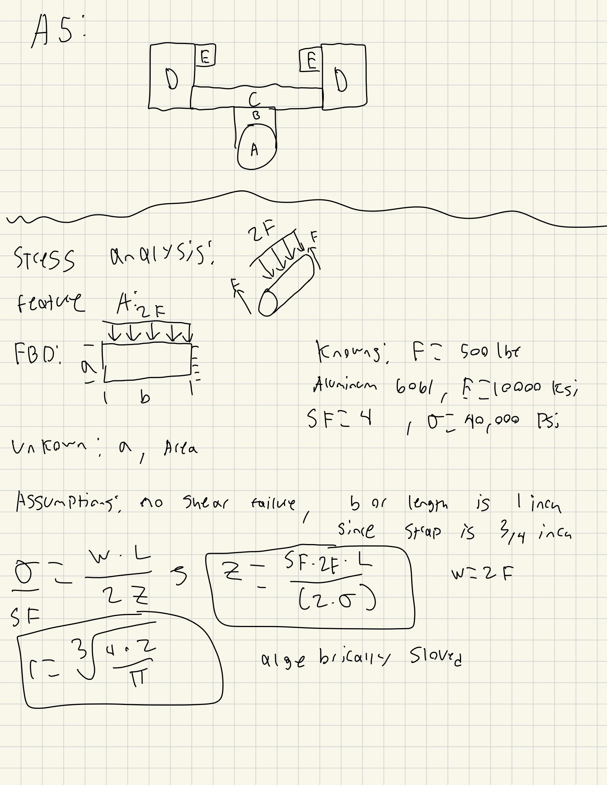
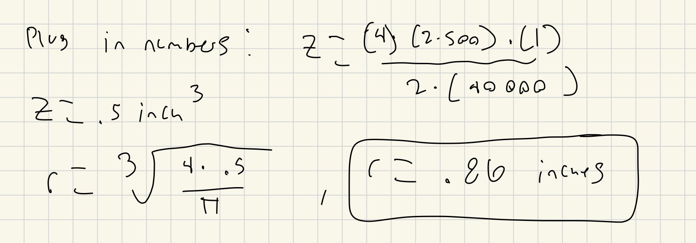

After solving for the radius both algebraically and numerically I got a required radius of .86 inches for this feature. Now moving onto part B as it is directly connected to A the first thing I do is draw the FBD. After drawing the FBD i write all of my knowns and see that i need to solve for the thickness of this feature. I will also assume that the width of this feature to be equal to the radius of feature A so 1.72 inches which a height of 2 inches. 

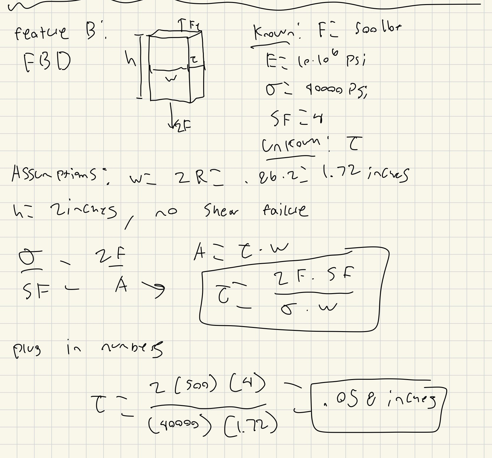

I got a thickness of just .058 inches for feature B. The next feature is C which is direclty connected to B. I draw the FBD and list all the knowns whoing me I am solving for the height of this peice. I the assume That the total width of this piece is 4 inches to give plenty of space and the lentgh to be 1 inches to try and make the hwole design uniform.

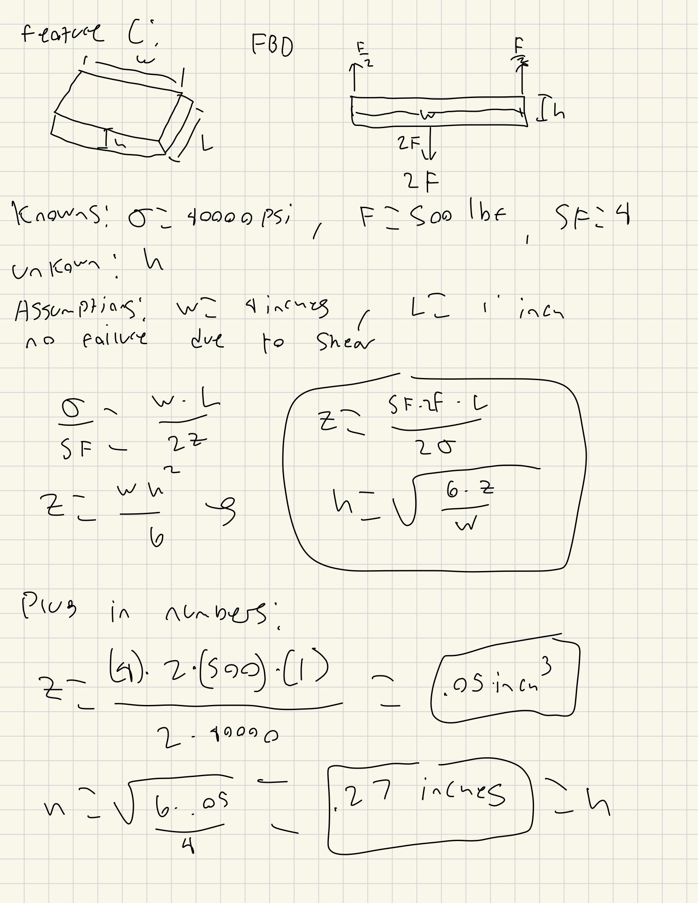

This have me a height of .27 inches for feature C. Naturally the next piece is D and after my FBD and knowns i see i need to solve for the width of this feature. I will assume that the length of this is also 1 inch to be uniform and the height to be .75 inches. 

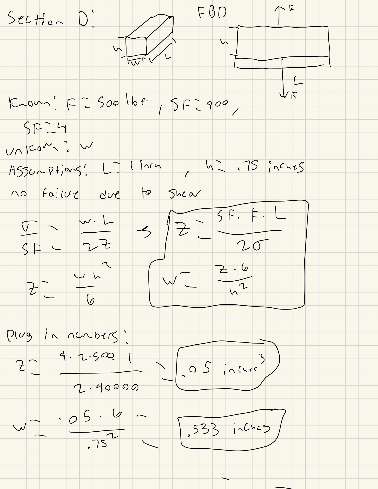

The width for feature D is .533 inches. The last feature to solve for is feature E and I can see that i need to solve for the hieght of this peice. In oprder to solve for this i assume the length to be 1 inch and the width to be .5 inches. 

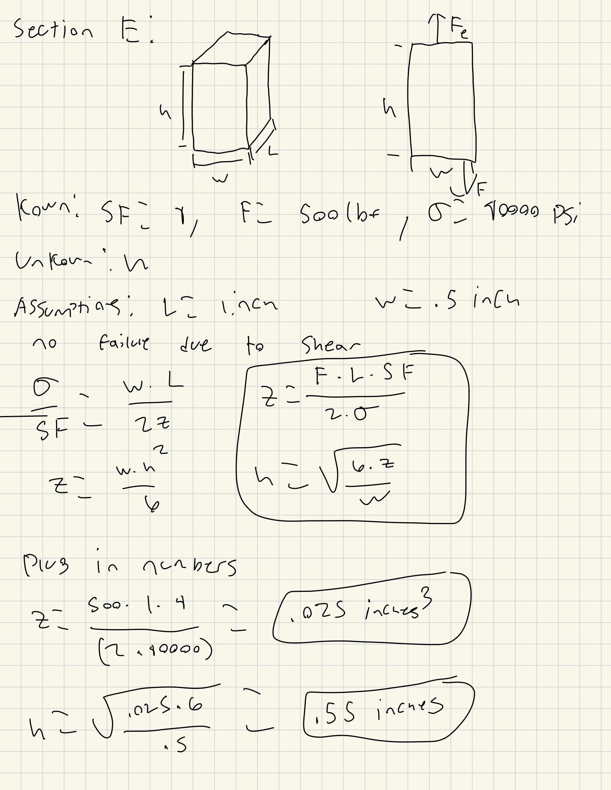

## Calculating Dimensions from Stiffness Analysis

For this next bracket design I will be using the bending and stiffness of the material to find all aspects with a max deflection of .005 inches.

I will do the same as before where I start out drawing the free body diagrams and the writing out all of my knowns. All of the unknowns and the assumptions are the same as the stress analysis  the only difference is we will no be using the stiffness of the aluminum with a E of 10*10^6 PSI.

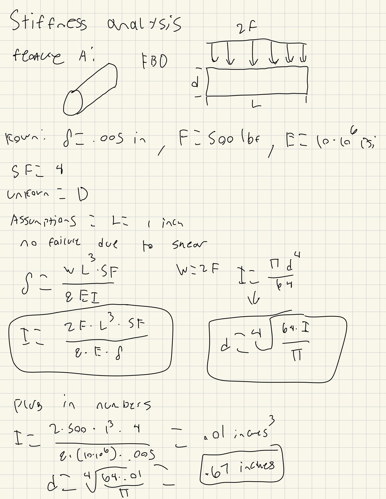

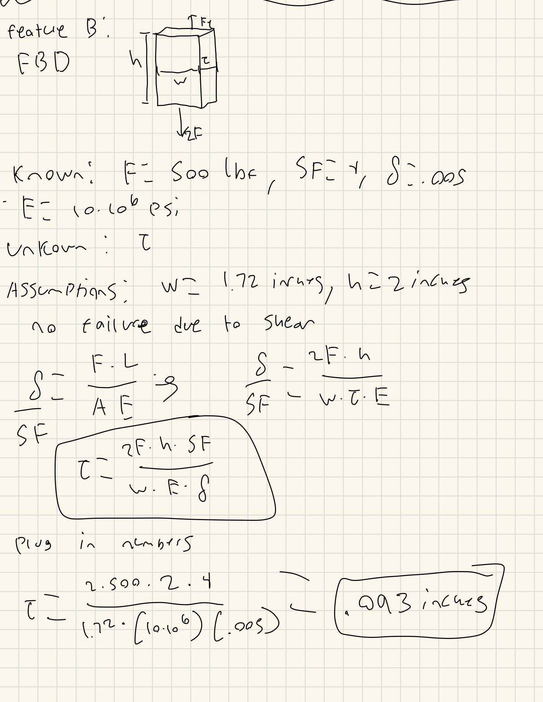

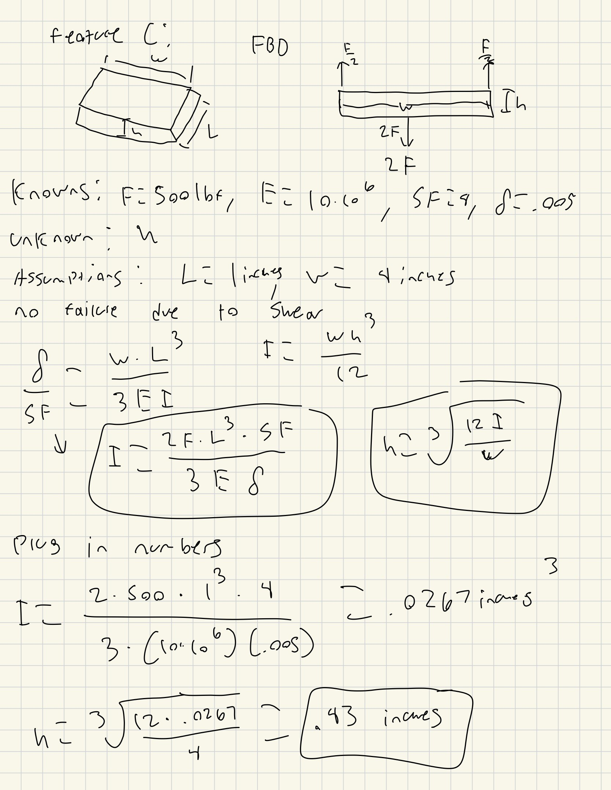

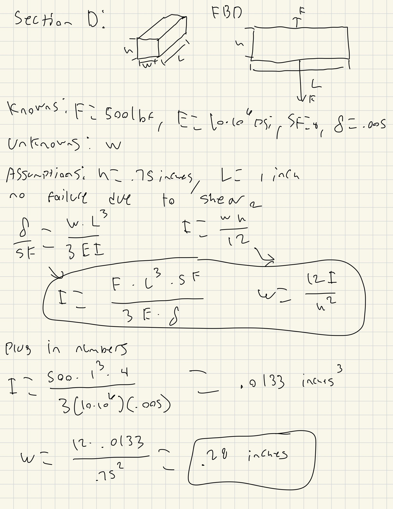

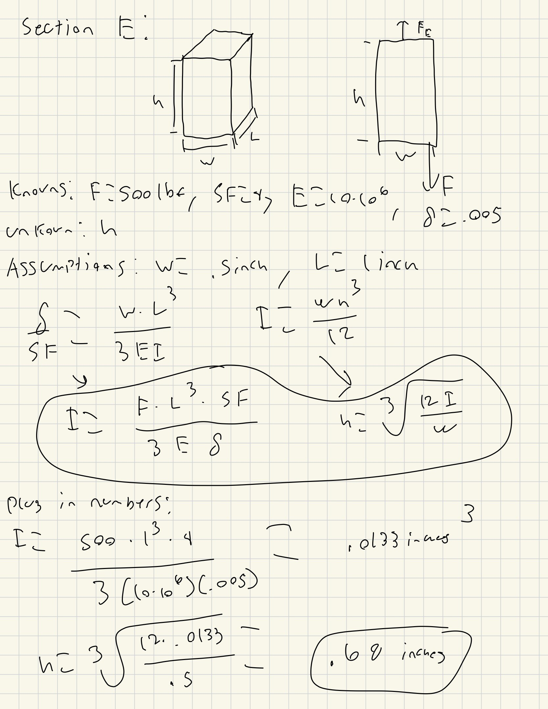

From these calculations I got both larger and smaller numbers than the stress analysis for different features. For instance my diameter for the stiffness calculation is much smaller than my diameter for my stress calculation but my height for feature C from my stiffness calculations is double that of the one from my stress calculations.  

### Multiview Sketches

The last thing to do was to draw multiveiw sketches of full design from botht he stress calculations and the stiffness calcuations.

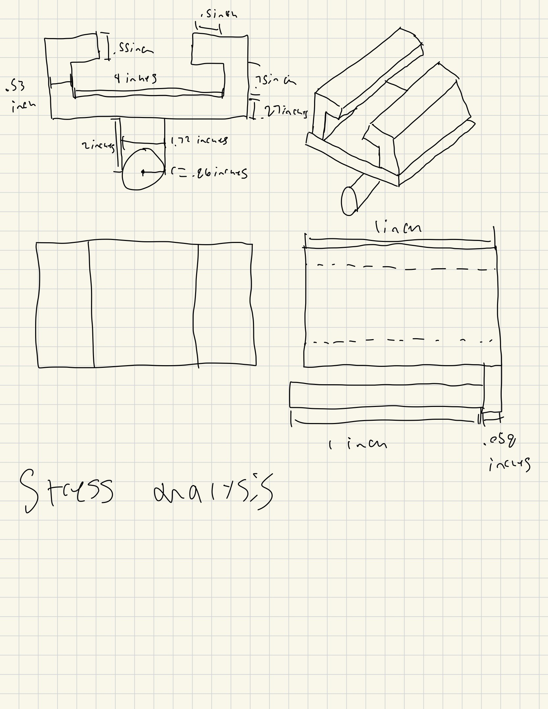

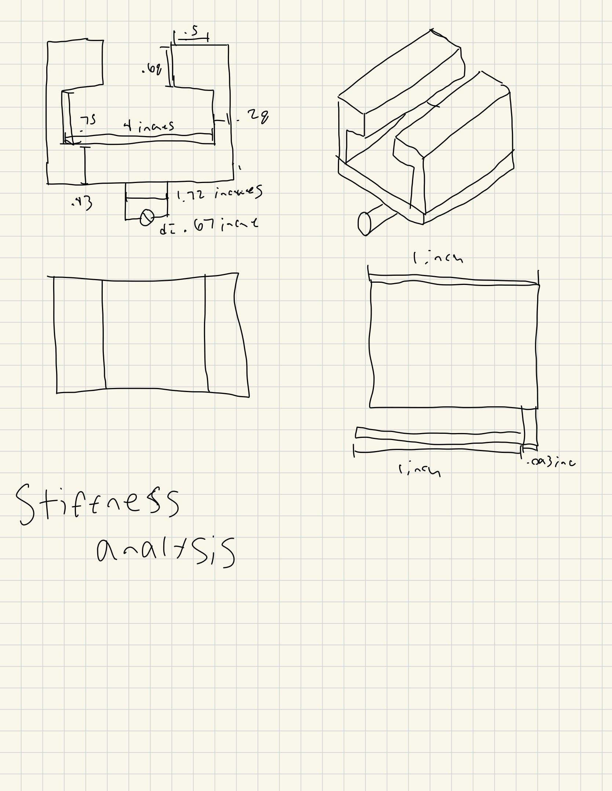

## Lessons Learned 

Overall it was a mix between my stress and my stiffness calculations for which governed the final dimension. For example my stress calculations governs my diameter feature with a diameter of 1.72 inches while my stiffness calculation only had a needed diameter of .67 inches. But for my feature C my stiffness calculation governs the final dimension with a height of .43 inches while my stress calculations had a height of only .27 

One instance in my design where a value came from a previous feature was my feature B. For feature B I made the width equal to the diameter from feature A to make the design more unform. Even with carrying values from one feature to the next no errors had occurred as I made sure all values made sense and were not crazy out of proportion. 

The main assumption I did that would change all of my calculations is the material I used. I decide to go with Aluminum 6061 but if i instead would have chosen a material like titanium my stiffness and yield strength would both be much higher making all of my calculations smaller than what they are for the aluminum material.

Overall this assignment took me around 7 hours to complete to get all of my hand calculations done and to create the portfolio.

