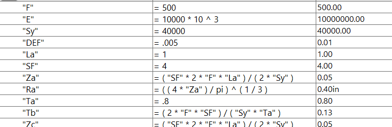
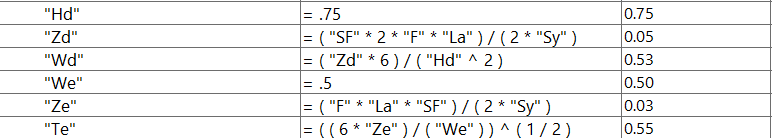
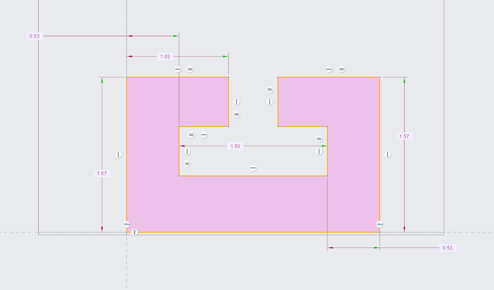
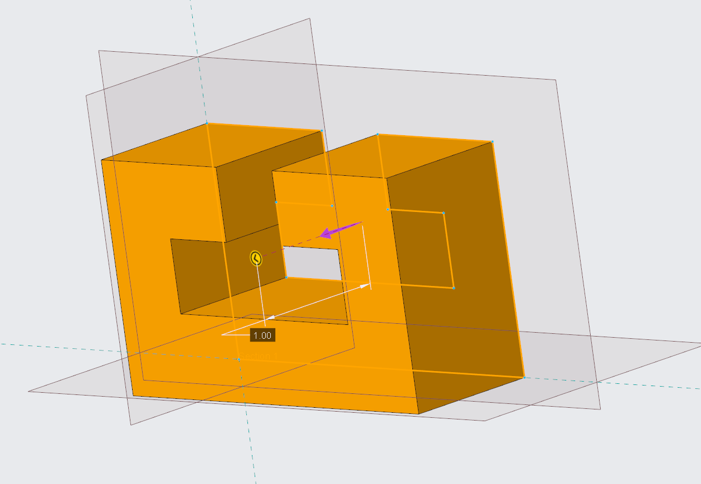
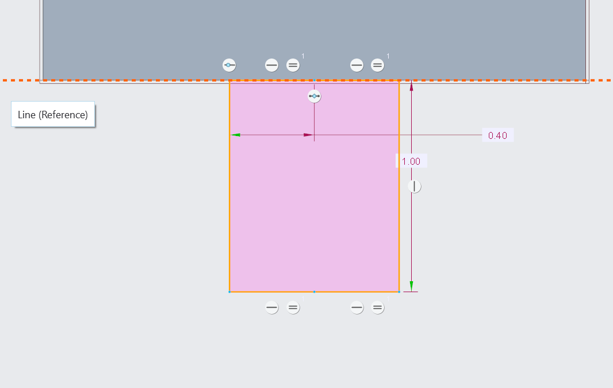
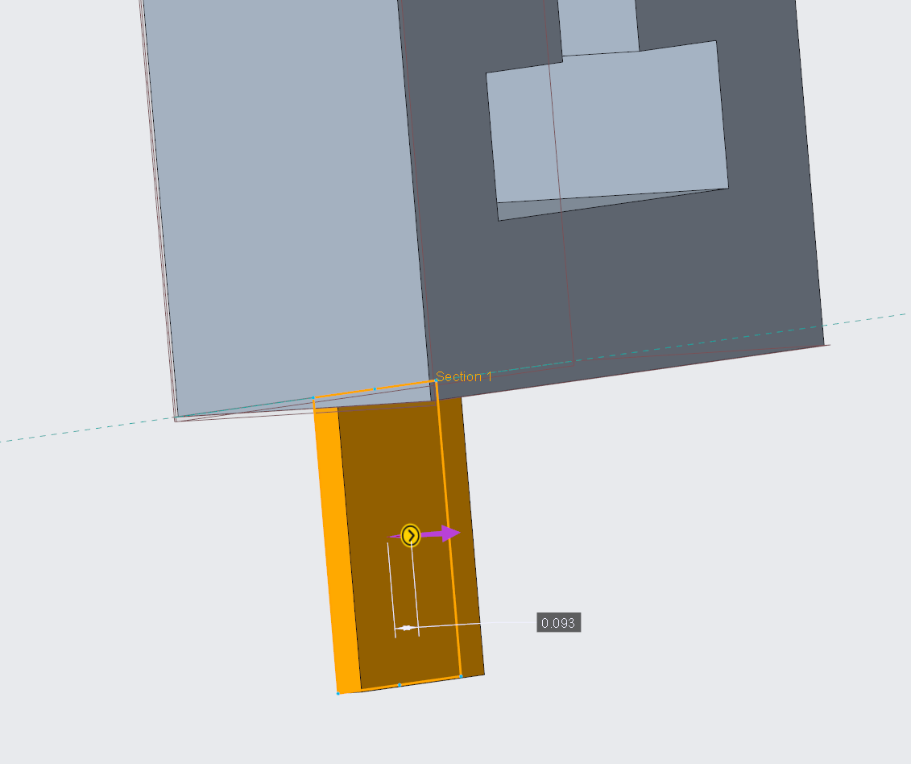
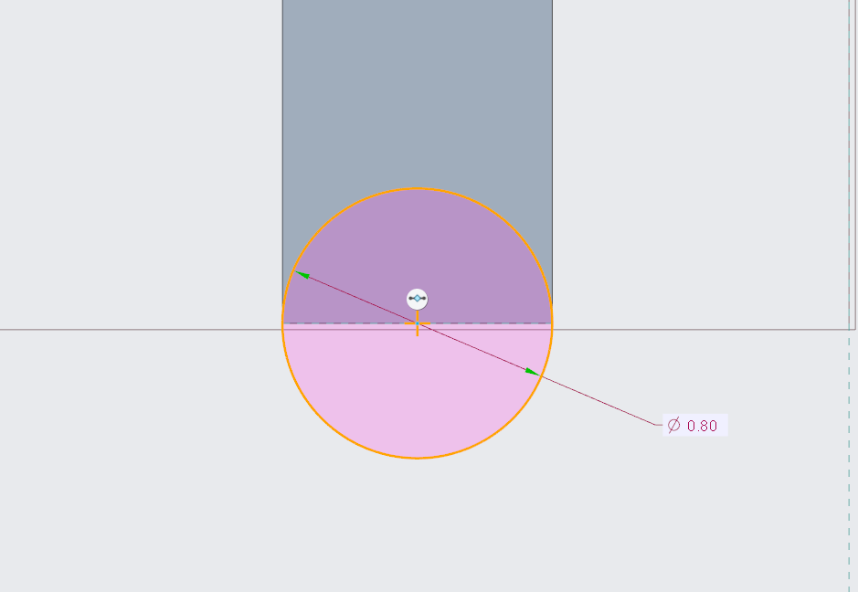
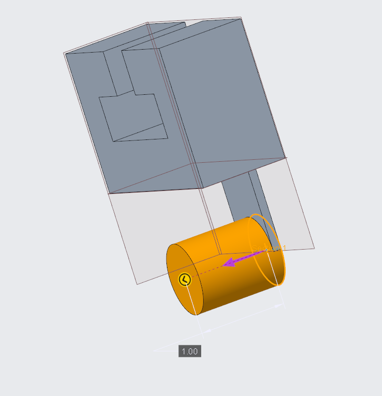

# A6 – [Bracket Drawing]

## Objective

The objective for this assignment was to generate a comprehensive solid model and a multi-view engineering drawing that accurately represents your designed bracket, incorporating all features to ensure both strength and stiffness requirements are met.

## CAD Modeling

### Parametric Model

The first thing to was to decide to use either my siffness of strength values form the previous assignment. I decided to go with my strength values as most of them were larger then my sitffness meaning they would meet both requirements under the load. After choosing which design i will be modeloign i started ot enter all of the parameter into my equation editior. After plugging in all equations and numbers into CAD I am now able to model the enitre designin paramtetrically

I first started by modeling the T Block shape into my main body using all of my parametric values and extruded it to 1 inch.

From there I connected the bottom piece to the underside of the main body using the thickness from my equations

Finally I connected the cylinder feature that allows the strap to hook onto the design and my model was finished

## CAD Drawing

Now having the finished my model I can then move onto the drawing. I used thridng angle projection with an isometric veiw in the top left. I included all dimension that are nessacary to remake this peice and to easily understand what this design looks like. I also added a title and a tolernace block in the bottom right to make sure all relavat informaiton is avaliblee. The final thing to do was to add tolernaces to the three dimensions that make the shape for the T block to fit in because the T block itself has very specific tolernaces for its shape and size. 

## Reflections

A.) I used my strength anaytlical equation to get my radius for the feature that the Uline starp will attach too. The main reason I choose this was because it was larger than my siffness value so i choose the larger value to ensure it could withstand both strength and stiffness when needed. I first started by entering all of my knowns into equation editior and solve for the Z for a speherical feature for strength. Once I had my Z i should do ((4*Z)/(pi))^1/3 to get my radius of .4 or a diamater of .8. This is differnet from my orgianl clauclation in the last assignment as it seems i had made an error when plugging in my yeild strength and got a diamter of 1.72 sinetad of .8 but it did not lead ot another further errors.

B.) One dimension i applied a tigetehr tolernace gap to was my wing thickness on the otp of the bracket. I had to apply this tighhter tolernace because the T beam istelf was alredy at a tight tollenrce and I had to make sure that the T beam would be able to fit into the desired slot so i made sure that the Width was never smaller than the width of the T blcok to ensure the bracket would fit onto the block and would work properly. A tolernce i allowed to be loower is the outside thickness of the piece since it is not directly interating wiht anything and alredy has a saftey factor of 4 meaning it will withstand its load and work properly inside the whole tolernace range

Overall this assignment took me about 4 hours as i am getting better with modeling parametrically

## Communicate

